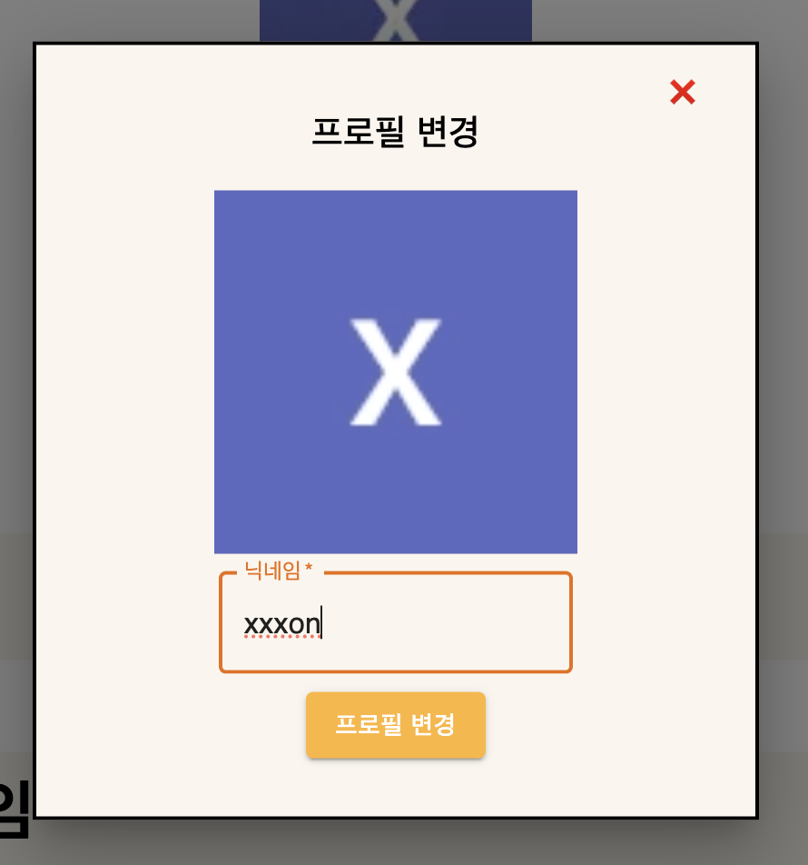

# Instant Crew

## 프로젝트 내용 
이용자가 관심사 카테고리(맛집, 문화예술 등)를 선택 하면 해당 카테고리 게시글들을 최신순으로 보여주고 등록할 수 있게 하여 이용자간의 상호작용을 목적으로 하는 어플리케이션 

## 개발 일정
2023.12.26 - 2024.01.03 
## 사용 스택

 

# 웹페이지 설명

## 메인페이지

메인페이지에서는 추천 게시물과 최신게시물 및 카테고리를 확인할 수 있다.

## 로그인 & 회원가입

로그인과 회원가입을 할 수 있고, 소셜로그인또한 가능하다.

## 마이페이지

마이페이지에서는 자신이 작성한 글과 참여한 모임을 볼 수 있다. 
프로필변경또한 가능하다.

## 카테고리

카테고리별 모임 게시글을 확인할 수 있다.

## 게시글

게시글을 작성할 수 있으며, 게시글에서는 댓글도 작성할 수 있다.